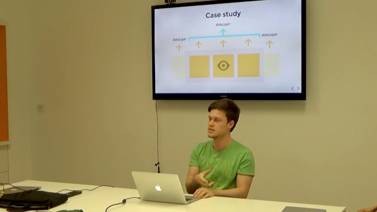

<p align="center">
  <a href="https://www.npmjs.com/package/events-pool" title="NPM version">
    
  </a>
  <a href="https://www.npmjs.com/package/events-pool" title="Dependency status">
    
  </a>
  
  <a href="https://coveralls.io/github/kettanaito/events-pool?branch=master">
    
  </a>
</p>

<p align="center">
  <a href="https://github.com/kettanaito/events-pool">
    
  </a>
</p>

# Events pool
Accumulate multiple events from different sources into a single pool and dispatch a callback function afterward. Supports data aggregation as well!

## Getting started
### Installation
Install `events-pool` using NPM:
```
npm install events-pool --save
```

### Usage
```js
import EventsPool from 'events-pool';

/* Create a new event pool */
new EventsPool({
  events: 'promotionView',
  target: carouselDOMElement,
  callback(events, data) {
    dataLayer.push(data);
  }
});

/* Dispatch a custom event with data */
const promoViewEvent = new CustomEvent('promotionView', {
  /* Accumulated data is accessible from callback's "data" argument */
  detail: { ... }
});

carouselDOMElement.dispatchEvent(promoViewEvent);
```

### Options
#### `events: Array<string> | string`
A single event or a list of event names to listen to.

#### `eventTarget: EventTarget`
**Default:** `document`

Target (DOMElement) which is expected to dispatch the event(s).

#### `timeout: number`
A duration (ms) of the timeout. When `aggregate: true`, stands for a time limit within which a new event is expected after catching the previous one.

#### `callback: Function(events: Array<CustomEvent | Event>, data: Array<mixed>)`
A callback function executed once the timeout is reached. An instance of each caught event (`Event` or `CustomEvent`) is being accumulated into a single pool available under the `events` argument.

Each data provided through `CustomEvent.detail` is accumulated and accessible under the `data` argument.

#### `aggregate: boolean`
**Default:** `false`
Enable/disable aggregation mode. When the latter is enabled, each caught event prolongs the time within which the pool expects to receive a new event by the amount of `timeout`. Once no events are received within this time period, a `callback` function is called.

## Contribution
Please see the [Contribution guide](./CONTRIBUTING.md) if you would like to contribute to this repository. Thank you.

## Lightning talk
See me giving a lightning talk about EventsPool, how it came to be and how it helped to solve an interesting use case.

[](https://www.youtube.com/watch?v=at396ZXkxhE)
